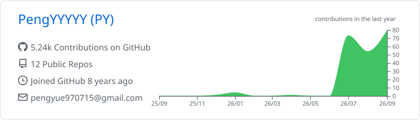
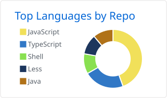
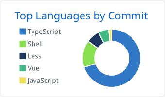
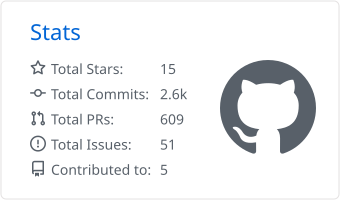
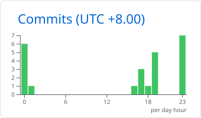

<h1 align="center">Hi, I'm PY 👋</h1>

Developer @ Tencent · ShangHai, China

## 📈 GitHub Activity

Generated by [GitHub Profile Summary Cards](https://github.com/vn7n24fzkq/github-profile-summary-cards) and refreshed automatically.

  

<!-- 

  
  

  
  

 -->
